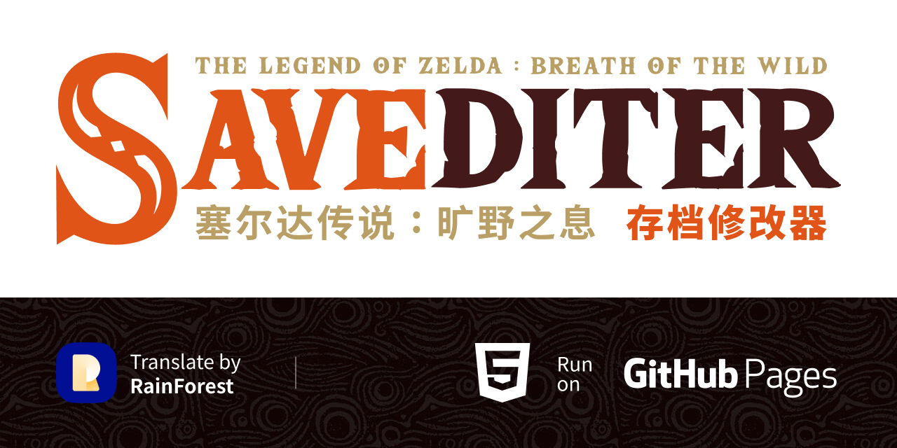

# Botw---Savediter
塞尔达传说：旷野之息 游戏存档修改器

----

### 当前进行中

- UI界面的改造 [设计文件 - Figma](https://www.figma.com/file/soYx0CKkQkFEdFc3pUdC6I/Botw-Savediter?node-id=2%3A18&t=neAXrD9xBkXkUOsr-1)

### 项目进度 90%

UI 界面：
- 起始页面 100% 中文的logo 和 文字
- 修改器内页 100%

----

物品词条：
- 武器 100%
- 盾 100%
- 衣服 100%
- 弓箭 100%
- 材料 100%
- 料理 100%
- 重要物品 40/42 （ 马匹 原作者还有很多词条没有添加 还需要增加词条 ）

### 难题

- 料理的中文名称（ 不能简单的中文翻译，需要和游戏内保持一致。）
- 高级编辑 中使用的是 CSV 数据库，这个不知道如何修改。但是这个操作普通玩家应该用不到吧。高级玩家应该无压力，所以就这样吧，这部分不翻译了。哈哈。

### 求助

如果你愿意一起帮忙，可以在 https://github.com/kailous/Botw-Savediter/tree/main/assist 找到还没翻译完成的词条库。
当前还有一个: 

- other.js 这个是重要物品的词条库

翻译遵循和中文版游戏内保持一直的原则，所以不需要机器翻译，或者个人翻译。

### 关于 savediter.sh 这个脚本

这个是一个修改存档的辅助脚本，配置好后，可以自动创建存档备份，打开存档目录&修改页面。
提供了清理配置文件和存档备份的功能。这个脚本要求你保持 mlc01 文件夹在默认位置。

### 鸣谢
- 修改器的原项目：https://github.com/marcrobledo/savegame-editors/tree/master/zelda-botw
  在线的修改器，所以能跨平台，这大概是 MacOS 上能找到的最好的修改器了。
- Botw 的 Wiki：https://zelda.huijiwiki.com/
  中文世界中，大概这是最规范的《塞尔达传说：旷野之息》Wiki了，中英日多语言支持，给翻译工作提供了非常多的便利。

----

### 本地版本
   
### Botw-Savediter-Local
塞尔达传说：旷野之息 游戏存档修改器的本地单文件版本  
本来想打包 App 的，但是发现再怎么压缩文件都很大，不如就单个页面文件吧。没有把 [css] 和 [js] 等等 都放到本地是因为后期更新不太方便。这样一个单html文件直接放在 [mlc1] 根目录去，使用起来也比较简单。

----

*tips：这个本地版的，主要是为了解决一个痛点，就是存档编号的问题，以往需要对照着图片确认是哪个存档。但现在这个但文件版本可以获取到存档的截图直接列出来，并标注上编号。方便确认那个是你需要修改的。*

[Botw-Savediter-Local Github](https://github.com/kailous/Botw-Savediter-Local/)
